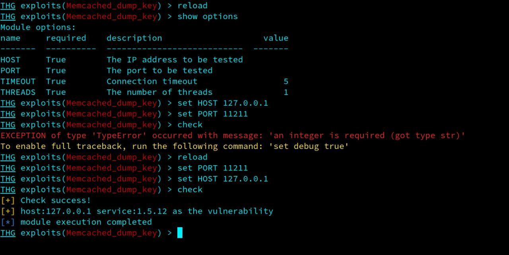
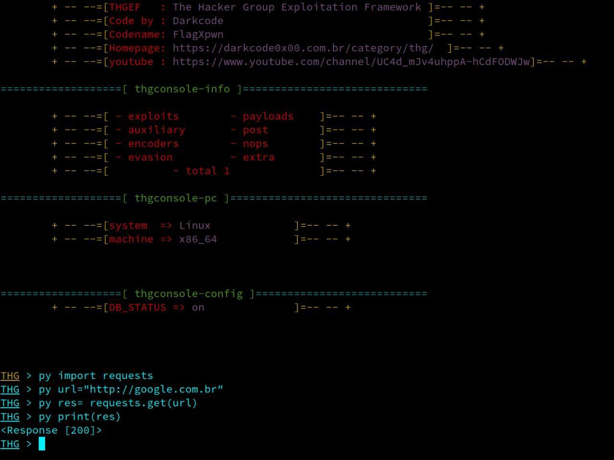
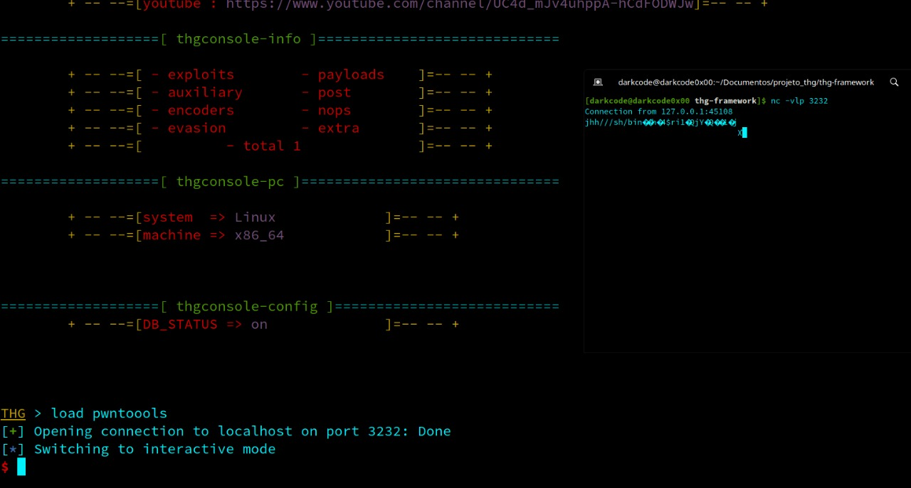

 thg-framework - exploit dev/toolkit


[](https://pypi.python.org/pypi/pwntools/)
[](criar_site_documentação)
[](http://choosealicense.com/licenses/mit/)
[](http://twitter.com/DarkcodeHacking)

O THG é um framework voltado para teste de segurança e jogos de  ctf, porém pode ser usado como uma biblioteca para desenvolvimento de exploits.
Escrito em Python, é projetado para prototipagem e desenvolvimento rápido e tem como objetivo tornar a escrita de exploit a mais simples possível,
dando a possibilidade para o explorador/dev ter total controle da ferramenta em tempo de execução, podendo trabalhar tanto como console de exploração tanto como o console
interativo do python em seu modo dinâmico, dando total flexibilidade na hora da exploração


-

-

com um diferencia super importante sendo capas de carregar modulos dinamicamente durante a execução do modo interativo 
do console 
# Documentação
para voce entender bem como o thg  funciona, recomendo seguir essas list a de recomendações, onde iremos aborar os principais passoa passo para 
voce ter um bom intendimento de como as coisas funcioano

1=>Nossa documentação está disponível em [https://darkcode0x00.com.br/thg](http://darkcode0x00.com.br/thg)

2=>Uma série de tutoriais também está disponível online [tutorial de como usar o thg](https://github.com/darkcode357/thg-tutorial#readme)

3=>Para começar, fornecemos algumas soluções de exemplo para desafios anteriores de CTF em nosso [repositório de write-ups](https://github.com/darkcode357/thg--write-ups).
# Instalação
O THG e um sistema genérico de exploração voltada para qualquer tipó de interface de comunicação desde servidores ate aplicações e coneções seriais
a suas funções funcionaao em todos os sistemas base Posix  
A maior parte da funcionalidade do thg é independente e funciona diretamente no Python puro. Você deve ser capaz de começar a trabalhar rapidamente com

```sh
apt update
apt upgrade
apt install python
apt install python-pip
apt install git
git clone https://github.com/darkcode357/thg-framework
cd thg-framework
pip install virtualenv
virtualenv envthg
# para bash
source envthg/bin/activate
# para fish 
source envthg/bin/activate.fish
# para csh
source envthg/bin/activate.csh
# para xsh
source envthg/bin/activate.xsh
# para ps1
source envthg/bin/activate.ps1
pip install -r requirements.txt
python3 thg.py 
```

No entanto, alguns dos recursos (assembling/disassembling foreign architectures) requerem dependências não-Python.


# Contribuir para o projeto

See [CONTRIBUTING.md](./CONTRIBUTING.md)

# CONTATO 

se vc tem alguma duvida/bug referente ao thg, abra uma nota issues no github [bug report](https://github.com/darkcode357/thg-framework/issues)

#NOTAS DE RODAPE
